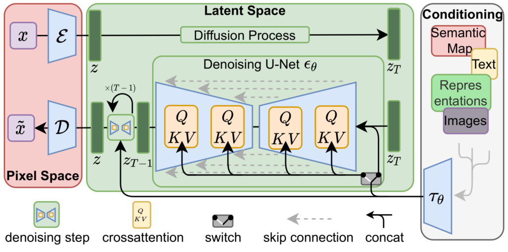
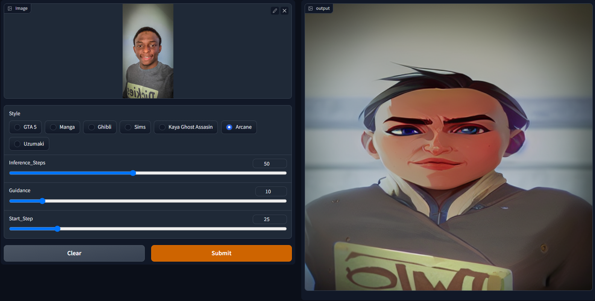
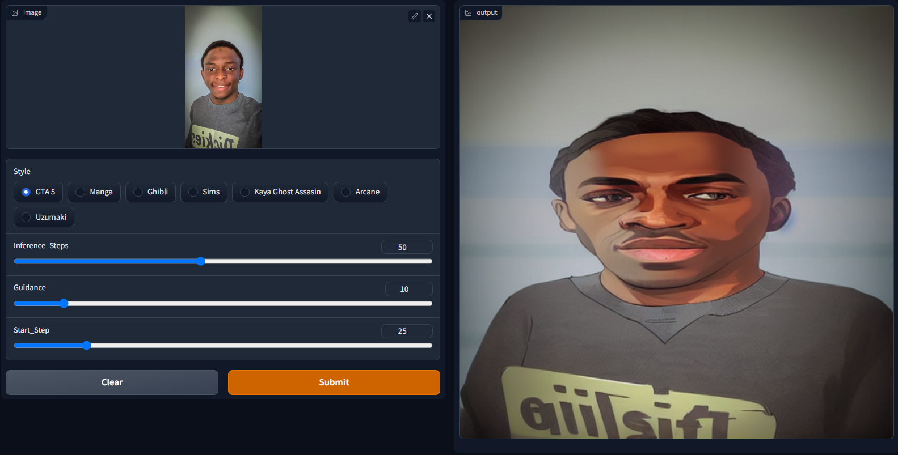
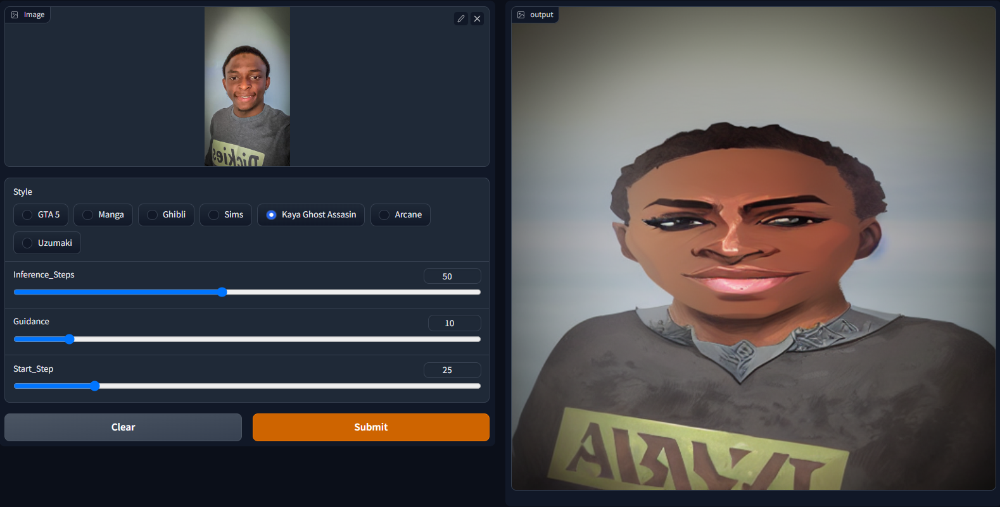
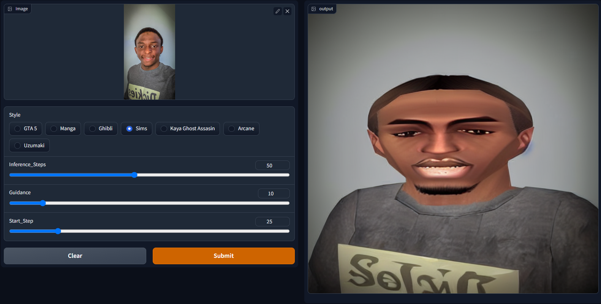

# Change-Your-Style
> Change-Your-Style named after the popular Nigerian rhyme is a Stable Diffusion application that brings together the concept of Image to Image and Textual Inversion. It changes the concept/style of input images (preferrably portraits) to one of seven predefined styles. 

> It uses a custom stable diffusion loop with an image as the starting point (input image) and a new 'learned' style embedding slipped into the embedding of a prompt - which acts now as just a placeholder actually. 

# Model Architecture
### Stable Diffusion



Diagram from [here](https://arxiv.org/abs/2112.10752)

### Textual Inversion


Diagram from [here](https://textual-inversion.github.io/)

# Built Using
- [Python](https://python.org)
- [PyTorch](https://pytorch.org/)
- [Hugging Face](https://huggingface.co/)
- [Stable Diffusion](https://stability.ai/blog/stable-diffusion-public-release)
- [Stable Diffusion Concepts Library](https://huggingface.co/sd-concepts-library)
- [Gradio](https://gradio.app/)
- Others

# Prerequisites and Installation
- Windows
```
python venv env_name
cd env_name
Scripts/activate
python -m pip --upgrade pip
python -m pip install -r requirements.txt
```
- Unix/Linux
```
sh setup.sh
```

# Project Structure
```
│   main.py
│   app.py
│   utils.py 
│   setup.sh    
|
├── models
│   ├──scheduler.pt
│   ├──text_encoder.pt
│   ├──tokenizer.pt
│   ├──unet.pt
|   └──vae.pt
|
└── learned_embeds
    ├──arcane_learned_embeds.bin
    ├──ghibli_learned_embeds.bin
    ├──gta_learned_embeds.bin
    ├──kaya_learned_embeds.bin
    ├──manga_learned_embeds.bin
    ├──sims_learned_embeds.bin
    └──uzumaki_learned_embeds.bin
```
# Usage
- FastAPI Option

    Follow the code [here](#prereq), it should launch a server in your localhost with some port. Head over to "change-your-style" page and use the Gradio interface. Sample:
    > localhost:8000/change-your-style
- Hugging Face Spaces Option
    
    Head over to [Change-Your-Style](https://huggingface.co/spaces/deedax/Change-Your-Style) and interact with the Gradio interface. This is much easier and doesn't require you to download any heavy models. The caveat is that it runs on a space that uses a CPU only (which means inference is super slow!) 

# Demo
### Arcane Concept


### GTA 5 Concept


### Kaya Ghost Assasin Concept


### Sims 2 Concept


# References
- [Stable Diffusion Hugging Face Model Card](https://huggingface.co/CompVis/stable-diffusion-v1-4)
- [Stable Diffusion Deep Dive by John O. Whitaker](https://github.com/fastai/diffusion-nbs/blob/master/Stable%20Diffusion%20Deep%20Dive.ipynb)
- [Stable Diffusion Concepts Library](https://huggingface.co/sd-concepts-library)
- [Hugging Face Stable Diffusion Notebook](https://colab.research.google.com/github/huggingface/notebooks/blob/main/diffusers/stable_diffusion.ipynb)

# Contact

Dahir Ibrahim (Deedax Inc) - http://instagram.com/deedax_inc <br>
Email - suhayrid@gmail.com <br>
YouTube - https://www.youtube.com/@deedaxinc.3389 <br>
Twitter - https://twitter.com/DeedaxInc <br>
Project Link - https://github.com/Daheer/Change-Your-Style
